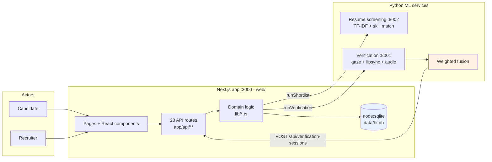

# PROV — Provable Skill Verification for Hiring

> Evidence over assertion.

PROV is a hiring platform that replaces "trust me, I'm good at this" with two
things a recruiter can actually check: **a short, timed, skill-specific work
sample**, and **integrity signals kept deliberately separate from how well
someone scored**.

The central design decision is that **challenge performance and integrity are
two different measurements**. They are stored in different columns, they are
never blended into one number, and neither one can overwrite the other. A
candidate who scores 100% on all three challenges *and* trips an integrity
signal is shown to the recruiter as exactly that — a strong answer set and a
flag, side by side, for a human to weigh.

---

## Table of contents

- [The problem](#the-problem)
- [Target users](#target-users)
- [The solution](#the-solution)
- [Candidate flow](#candidate-flow)
- [Recruiter flow](#recruiter-flow)
- [Tech stack](#tech-stack)
- [AI/ML overview](#aiml-overview)
- [Architecture](#architecture)
- [Setup](#setup)
- [Limitations](#limitations)
- [Team](#team)
- [Further reading](#further-reading)

---

## The problem

Hiring on the basis of a resume plus a vibe has three specific failure modes,
and PROV targets each one:

1. **Resumes overstate skill.** A keyword-matching screen ranks whoever wrote
   the most impressive document, not whoever can do the work. Screening scores
   are also opaque: a candidate who is rejected has no way to find out why.
2. **Take-home tests are unbounded and unsupervised.** They measure the ability
   to search the internet for eight hours, and they cannot distinguish a strong
   candidate from a candidate with a strong friend and a second monitor.
3. **The recruiter sees a single blended number.** Most tools collapse
   "answered well" and "looked like they were cheating" into one score. That
   hides precisely the case a human needs to look at, and it invites automated
   rejection of candidates on the strength of a single noisy signal.

There is a fourth, quieter problem: **the candidate is never in control.** They
cannot see what was measured, why they were ranked where they were, or what
they could fix. A hiring process nobody can audit is one nobody trusts.

## Target users

| User | What they need | What PROV gives them |
| --- | --- | --- |
| **Early-career candidates** (students, interns, career switchers) who are screened out by keyword matching | A fair, skill-relevant shot and a reason they can act on | Three challenges matched to their declared skills, deterministic and auditable scoring, and a visible breakdown of what was measured |
| **Candidates in fields without a strong credential signal** (design, psychology, HR) | Proof that does not depend on pedigree | Timed, role-relevant written work in a curated challenge bank, scored by an inspectable rubric |
| **Recruiters and hiring managers** with limited time per applicant | A defensible shortlist and the reasons behind it | Skill match, ML screening score, per-challenge performance and integrity signals — all shown separately, with a human always making the final call |
| **Candidates worried about being unfairly flagged** | Not to be auto-rejected on a noisy signal | `REVIEW` and `FLAGGED` route to a human. They are prompts to look, never a verdict. The platform never uses the word "cheating" |

## The solution

PROV is a full-stack hiring platform with a real, working ML backbone. Four
pieces:

**1. ML resume screening.** Applicants are ranked against a job's required
skills using a weighted combination of skill coverage and TF-IDF similarity,
then multiplied by a verification multiplier. The score is a real model output,
and the recruiter sees the component breakdown, not just a number.

**2. Deterministic skill-based challenge curation.** When a candidate starts a
verification session, PROV picks **exactly three** challenges from a
hand-authored bank of 15, matched to the candidate's declared skills and
profile text. Curation is a pure function of the candidate's id, so it is
reproducible and inspectable — a recruiter can always answer "why these three?"

**3. A 30-minute, server-authoritative session.** The candidate answers all
three. The clock is written once from the server's clock and enforced on every
read and every write. Reloading, opening a second tab, or changing the system
clock does not buy a single extra second. A refresh resumes the same session
rather than minting a fresh 30 minutes.

**4. Verification ML that reports, it does not accuse.** A separate Python
service scores gaze, lip-sync and audio from a recorded clip and fuses them into
one of `pass` / `flagged` / `fail`. PROV maps that onto product vocabulary of
`NORMAL` / `REVIEW` / `FLAGGED`. `fail` means "route to a human with suspicion"
— never "this person cheated", and never an automatic rejection.

**Plus a token economy** that rewards meaningful platform activity (completing
your profile, finishing an assessment, passing verification). Tokens are
explicitly *not* redeemable for anything, and they are **never shown to
recruiters and never enter any hiring score**, because engagement is not
merit.

## Candidate flow

1. **Sign up and build a profile** — name, email, headline, skills, resume
   upload (`.pdf`, `.docx`, `.txt`, `.md`; 10 MB cap). Resume text is parsed
   at upload time so it can be shown back immediately.
2. **Browse and apply to jobs** — open roles with their required skills.
3. **Run assessments** — optional multiple-choice assessments, scored
   server-side, with a persisted result page.
4. **Start a skill verification session** — press *Start 30-minute
   verification*. PROV curates exactly 3 skill-specific challenges and starts a
   30-minute server-side clock.
5. **Answer all three** — written responses, one submit each. A challenge
   cannot be edited after submission; the countdown turns amber at 5 minutes
   remaining.
6. **See the result** — challenge performance, the integrity label, the final
   result, time taken, and the individual integrity events, all shown
   separately.
7. **Earn tokens and achievements** — for activity, never for a better score.

The 30-minute window is a real constraint, not decoration: an answer submitted
after `expiresAt` is rejected with `409 SESSION_EXPIRED`.

## Recruiter flow

1. **Post a role** — title, company, description, required skills.
2. **Trigger screening** — *Run shortlist*. PROV calls the screening ML service,
   which scores every applicant's resume against the required skills and
   rewrites the ranking in a single transaction, so a partially-written
   shortlist is never shown.
3. **Read the ranked list** — rank, rank score, and a breakdown of resume score,
   skills score, TF-IDF score, matched skills and missing skills.
4. **Open an applicant** — the full record: score breakdown, stored verification
   result, and the skill verification panel.
5. **Weigh two separate measurements** — *Challenge performance* and *Integrity
   signals* are rendered as two independent figures. A flagged session is a
   prompt to review, not a rejection.
6. **Decide as a human.** No automated rejection exists anywhere in the system.

## Tech stack

Deliberately small. Three runtime npm dependencies and a Node builtin for the
database, so `npm install` cannot break the demo.

**Web application** — Next.js 15.5 (App Router), React 19, TypeScript 5.7.
Storage is `node:sqlite`, a **Node builtin** — no ORM, no native compile step,
no `better-sqlite3`. 28 API routes, all `runtime = "nodejs"` because they
require `node:sqlite`.

**Resume screening ML** (`:8002`) — Python, FastAPI + uvicorn. scikit-learn
`TfidfVectorizer` + cosine similarity, plus a word-boundary skill matcher with
an alias table. pypdf for PDF text extraction. **No persisted model** — the
vectorizer is fit in memory per request across the applicant pool and
discarded.

**Verification ML** (`:8001`) — Python, FastAPI + uvicorn. MediaPipe
`FaceLandmarker` (478-point mesh, iris landmarks) for gaze; SyncNet via
subprocess for lip-sync; librosa RMS voice-activity detection + `pyin` F0
tracking for a second-voice proxy; a weighted linear fusion. ffmpeg on `PATH`
for audio demux.

**Testing** — plain Node scripts with hand-rolled assertions, no test framework.
`web/scripts/verification-flow-test.ts` (15 labelled steps / 72 assertions, module-level, temp DB), plus
`tokens-test.mjs`, `achievements-test.mjs`, `assessments-test.mjs` and
`e2e-test.mjs` at the repo root.

## AI/ML overview

Full detail, including what the AI does **not** decide, is in **[ai.md](ai.md)**.
The short version:

| Component | Technique | Trained? | What it produces |
| --- | --- | --- | --- |
| Resume screening | TF-IDF + cosine similarity, word-boundary skill match with aliases | No — fit in memory per request | A 0–1 screening score and a rank |
| Challenge curation | Deterministic rule-based selection seeded by an FNV-1a hash of the candidate id | No — no model, no network call | Exactly 3 challenges |
| Challenge scoring | Inspectable rubric match (concept coverage + word-count depth) | No — explicitly *not* a model | 0–100 per challenge |
| Gaze | MediaPipe `FaceLandmarker` iris offset, pretrained | Pretrained, bundled | 0–1 + off-screen ratio |
| Lip-sync | SyncNet (external checkout via `SYNCNET_REPO_DIR`) | Pretrained, **not vendored** | 0–1 + raw confidence |
| Audio | librosa RMS VAD + `pyin` F0 + rolling-median deviation | No — heuristics, not diarization | 0–1 + second-voice frame ratio |
| Fusion | Weighted linear combination | No | `pass` / `flagged` / `fail` + reasons |

**Nothing in PROV is trained by us, and no model is fine-tuned.** Two real
models are used pretrained (MediaPipe, SyncNet); everything else is either an
in-memory statistical transform or explicit, readable arithmetic. There is no
LLM anywhere in the product, and no model-generated content reaches a candidate
or a recruiter.

**Every signal can fail neutral.** If a signal cannot be computed, it returns
`0.5` with a diagnostic note rather than `0.0` or `1.0` — the pipeline keeps
running and says so. And a session that produced *no* integrity reading at all
resolves to `REVIEW`, because "we have no reading" is itself something a
recruiter should see.

## Architecture

Full detail, with real repository paths and a component diagram, is in
**[docs/architecture.md](docs/architecture.md)**.



Three processes, three ports:

| Port | Service | Entry point |
| --- | --- | --- |
| `3000` | Next.js web app + API | `web/` (`npm run dev`) |
| `8002` | Resume screening ML | `resume_screening/service.py` |
| `8001` | Verification ML | `ml/verification/service.py` |

The browser never talks to Python directly. The web app is the only caller, via
a thin HTTP client (`web/lib/ml.ts`), and a deliberate one: the web app must
stay runnable with nothing but `npm install`, and during a demo you want to be
able to restart one service without rebuilding the other.

## Setup

Full instructions, including environment variables and troubleshooting, are in
**[docs/setup.md](docs/setup.md)**. The short version:

**Prerequisites** — Node.js 20+ (for `node:sqlite`; 22+ recommended), Python
3.10+, and ffmpeg on `PATH`.

```bash
# 1. Python services
python -m venv .venv
.\.venv\Scripts\activate           # Windows
pip install -r requirements.txt scikit-learn pypdf

# 2. Web app
cd web && npm install

# 3. Seed the synthetic demo dataset
npm run seed:demo
```

Then start three processes (Windows one-liner: `start-demo.cmd`):

```bash
# terminal 1 - resume screening on :8002
.\.venv\Scripts\python.exe -m uvicorn resume_screening.service:app --port 8002

# terminal 2 - verification on :8001 (BACKEND_BASE_URL must point at the web app)
$env:BACKEND_BASE_URL = "http://localhost:3000"
.\.venv\Scripts\python.exe -m uvicorn ml.verification.service:app --port 8001

# terminal 3 - web on :3000
cd web && npm run dev
```

Open <http://localhost:3000>. Check all three services with `GET /api/health`.

**Note on requirements:** `requirements.txt` does not list `scikit-learn` or
`pypdf`, both of which the code imports. Install them explicitly as shown
above. This is a known gap, recorded in
[docs/limitations.md](docs/limitations.md).

**Tests and build:**

```bash
cd web
npm run typecheck      # tsc --noEmit
npm run lint
npm run test:verification   # 72 assertions, no server or ML needed
npm run build
npm test               # verification + tokens + achievements + assessments
npm run test:e2e       # requires all three services running
```

## Limitations

Stated plainly, with detail in **[docs/limitations.md](docs/limitations.md)**:

- **The ML services are deployed separately.** Two extra processes, two extra
  ports, ffmpeg on `PATH`. Not a single-binary deploy.
- **Lip-sync needs a checkout that is not vendored.** Without `SYNCNET_REPO_DIR`
  the signal returns a neutral `0.5` and says so in diagnostics. The pipeline
  still runs, by design.
- **Browser camera and microphone are required** for the live verification
  flow.
- **All demo data is synthetic.** NovaHire Technologies, its recruiter, its ten
  candidates, their resumes, their screening scores and their verification
  signals are fabricated fixtures, labelled as such in the UI. See
  [ai.md](ai.md#10-synthetic-and-demo-data).
- **The ML signals have false positives and false negatives.** Gaze tracking is
  confused by glasses, lighting and screen reflections; a thinking pause looks
  like looking away. Thresholds are documented engineering choices, not
  empirically validated figures. There is no labelled evaluation set in this
  repository.
- **No authentication.** Per the hackathon rules, the MVP has none. Role
  selection is a client-side presentation concern only; every route validates
  its own inputs.
- **SQLite on a local filesystem.** Not built for concurrent multi-instance
  writes or for production security review.

## Team

| Name | Role |
| --- | --- |
| **Deeksha Ganiger** | Team Leader |
| **Trupti Iliger** | Team Member |
| **Omkar Shirol** | Team Member |
| **Joshua Endigeri** | Team Member |

Per-member contribution detail is in [resource.md](resource.md).

## Further reading

| Document | What it covers |
| --- | --- |
| [resource.md](resource.md) | Team details, live MVP details, a 3-minute reviewer path, submission checklist |
| [ai.md](ai.md) | AI tools, ML techniques, honest limitations, what AI does not decide |
| [docs/architecture.md](docs/architecture.md) | Real architecture, real repository paths, component diagram |
| [docs/constraints.md](docs/constraints.md) | The constraints PROV is built to hold to |
| [docs/setup.md](docs/setup.md) | Exact setup, run, seed, test and build instructions |
| [docs/limitations.md](docs/limitations.md) | What this prototype cannot do |
| [docs/images/](docs/images/README.md) | Screenshot list to capture before submission |
| [docs/anti-gaming-paper.md](docs/anti-gaming-paper.md) | Ranking formula and fraud-defence notes *(pre-existing; contains TODOs and placeholder figures)* |
| [README-mvp.md](README-mvp.md) | Original MVP notes *(pre-existing)* |
| [README-ml-anti-gaming.md](README-ml-anti-gaming.md) | Original verification-ML notes *(pre-existing; its lip-sync description is out of date — see [ai.md](ai.md#lip-sync))* |
