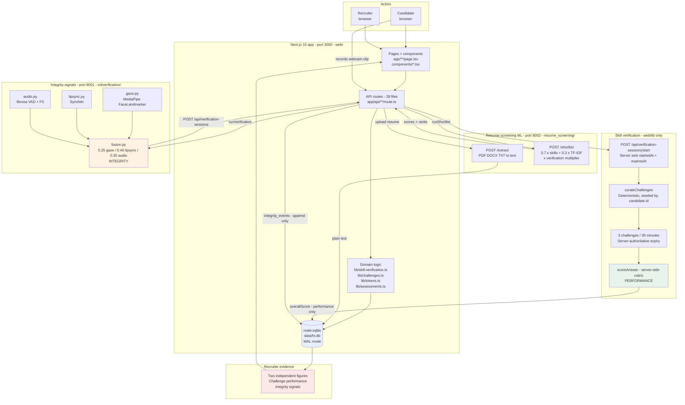

# PROV — Architecture

The real architecture of PROV, with real repository paths. Everything described
here exists in the code on the current `main` branch.

---

## Contents

- [The three processes](#the-three-processes)
- [End-to-end flow](#end-to-end-flow)
- [Repository layout](#repository-layout)
- [The two independent measurement tracks](#the-two-independent-measurement-tracks)
- [Data model](#data-model)
- [API surface](#api-surface)
- [Key design decisions](#key-design-decisions)

---

## The three processes

| Port | Process | Entry point | Runtime |
| --- | --- | --- | --- |
| `3000` | Next.js web app + API routes | `web/` (`npm run dev`) | Node.js, `nodejs` route runtime |
| `8002` | Resume screening ML | `resume_screening/service.py` | Python, FastAPI + uvicorn |
| `8001` | Verification ML | `ml/verification/service.py` | Python, FastAPI + uvicorn |

**The browser never talks to Python directly.** `web/lib/ml.ts` is the only
caller of `:8001` and `:8002`. The separation is deliberate and documented in
that file: the web app must stay runnable with nothing but `npm install`, and
during a demo you want to be able to restart one service without rebuilding the
other.

There is one reverse-direction call. The verification service POSTs its result
**into** the web app at `POST /api/verification-sessions`, because the web app
owns the database. The web app does not trust the echo — after the round trip
it re-reads SQLite rather than believing the response.

---

## End-to-end flow



**Read the two coloured tracks.** Green is *performance* (what the candidate
wrote). Orange is *integrity* (how the session behaved). They write to different
tables, they are computed by different code, and they reach the recruiter as two
separate numbers. Nothing in the pipeline blends them.

### Two distinct verification flows

PROV has **two** verification flows that share a name but nothing else. They are
separate tables that never reference each other.

| | **Skill verification** (3 challenges / 30 min) | **Live clip verification** |
| --- | --- | --- |
| UI | `/candidate/skill-verification` | `/candidate/verification` |
| Tables | `skill_verification_sessions`, `verification_challenges`, `challenge_attempts`, `integrity_events` | `verification_sessions` |
| Trigger | Candidate starts a session | Recruiter/candidate uploads a recorded webcam clip |
| Content | 3 curated written challenges, 30-minute limit | gaze + lip-sync + audio from a video file |
| Performance measure | `overallScore` (rubric match) | n/a |
| Integrity measure | `integrity_events` → `integrityStatus` | `gazeScore` / `lipSyncScore` / `audioScore` / `fusedScore` |
| Start endpoint | `POST /api/verification-sessions/start` | `POST /api/applications/[id]/verify` |

They are kept apart on purpose. The design note in `web/lib/db.ts` explains it:
extending `verification_sessions` with a 30-minute session "would have forced
nullable `applicationId` and broken that contract".

The two flows are joined at exactly one point — `integrityFromMlResult()` in
`web/lib/challenges.ts` maps the ML layer's `pass`/`flagged`/`fail` onto the
skill flow's `normal`/`review`/`flagged`, and the callback endpoint dispatches
on the `svs_` id prefix to decide which table to write.

---

## Repository layout

```
pli/
├── web/                                    Next.js 15 app - the product
│   ├── app/
│   │   ├── page.tsx                        role-selection landing
│   │   ├── about/  how-it-works/
│   │   ├── candidate/                      15 pages
│   │   │   └── skill-verification/         the 3-challenge / 30-min flow
│   │   ├── recruiter/                      7 pages
│   │   │   └── candidates/[applicationId]/ recruiter evidence view
│   │   └── api/                            28 route.ts files
│   ├── components/
│   │   ├── SkillVerification.tsx           candidate session UI
│   │   ├── RecruiterSkillVerification.tsx  recruiter read-only view
│   │   ├── VerificationRecorder.tsx        webcam + mic capture
│   │   ├── RankedCandidateTable.tsx        shortlist with score breakdown
│   │   └── ui.tsx                          EmptyState / ErrorState / DemoBadge / ...
│   ├── lib/
│   │   ├── db.ts                           node:sqlite + 15-table schema
│   │   ├── challenges.ts                   bank, curation, scoring, integrity map
│   │   ├── skill-verification.ts           session lifecycle, expiry, finalisation
│   │   ├── ml.ts                           HTTP client to :8001 / :8002
│   │   ├── tokens.ts                       server-authoritative currency
│   │   ├── assessments.ts  achievements.ts
│   │   ├── demo-data.ts                    synthetic fixtures (pure data)
│   │   ├── demo-seed.ts                    seed / reset engine
│   │   └── demo-marker.ts                  zero-import client-safe demo labels
│   ├── scripts/
│   │   ├── seed-demo.ts  reset-demo.ts
│   │   └── verification-flow-test.ts       15 steps / 72 assertions
│   └── data/hr.db                          SQLite (gitignored)
│
├── ml/verification/                        verification ML - port 8001
│   ├── service.py                          POST /verify, GET /health
│   ├── gaze.py                             MediaPipe FaceLandmarker
│   ├── lipsync.py                          SyncNet via subprocess
│   ├── audio.py                            librosa VAD + F0
│   ├── fusion.py                           weighted linear fusion
│   ├── evaluate.py                         P/R/F1 harness (no labels.json yet)
│   ├── oep_adapter.py                      dataset adapter
│   └── models/face_landmarker.task         pretrained bundle, 3.6 MB
│
├── resume_screening/                       screening ML - port 8002
│   ├── service.py                          POST /shortlist, /extract, GET /health
│   ├── score.py                            skill match + TF-IDF
│   ├── shortlist.py                        combination + multipliers
│   ├── extract_text.py                     PDF / DOCX / TXT extraction
│   └── selftest.py                         python -m resume_screening.selftest
│
├── docs/                                   this documentation
├── requirements.txt                        9 Python packages
├── start-demo.cmd                          Windows 3-service launcher
├── *-test.mjs                              4 Node test suites
└── README.md  resource.md  ai.md
```

---

## The two independent measurement tracks

This is the architectural commitment the rest of the system is built around.

### Track 1 — Challenge performance (green)

**Path:** `POST .../submit` → `scoreAnswer()` → `challenge_attempts.score` →
`overallPerformance()` → `skill_verification_sessions.overallScore`

- Deterministic rubric match: concept coverage (capped 85) + depth (15).
- **No model.** The UI says so.
- Computed server-side at submit time against a rubric the browser never
  received.
- An answer under the minimum length scores **0**, not a near-zero.
- `overallScore` is a **column comment away** from being confused with integrity,
  and the schema says explicitly: `-- challenge performance only, NOT integrity`.

### Track 2 — Integrity signals (orange)

**Path:** clip → `POST /verify` → `fuse()` → `POST /api/verification-sessions`
→ `recordIntegrityEvent()` → `integrity_events` → `rollUpIntegrity()` →
`skill_verification_sessions.integrityStatus`

- Three independent signals, fused with fixed weights.
- **Never enters the performance calculation.** `finalizeIfComplete()` computes
  them in separate statements.
- `integrity_events` is **append-only** — a new observation is inserted, never
  overwrites an earlier one.
- A session with **no** events resolves to `review`, not `normal`.

### Where they meet, and only there

```typescript
// web/lib/skill-verification.ts - finalizeIfComplete()
const integrity: IntegrityStatus = rolled ?? "review";
const overall: number = overallPerformance(scores);
const finalResult: FinalResult = integrity === "normal" ? "verified" : "review_required";
```

`overallScore` and `integrityStatus` are written in the same `UPDATE` and are
never combined. In the recruiter UI
(`web/components/RecruiterSkillVerification.tsx`) they are two independent
large figures, and the code states the reason: *"never combined into one number
here, because a single blended score would hide exactly the case that matters."*

### Ranking

Screening is the one place verification touches a score, and it is a
**multiplier**, not a blend:

```
rankScore = (0.7 x skills + 0.3 x TF-IDF) x verificationMultiplier
```

| Verification | Multiplier |
| --- | --- |
| `pass` | 1.2 |
| unverified | 1.0 |
| `flagged` | 0.5 |
| `fail` | 0.5 |

Flagged and fail are **discounted, never zeroed** — a flag is not a finding of
misconduct, and zeroing would be an automatic rejection by arithmetic.

---

## Data model

15 tables. The four that matter most for skill verification:

```sql
-- web/lib/db.ts - the separation, in the schema itself
CREATE TABLE skill_verification_sessions (
  id              TEXT PRIMARY KEY,
  candidateId     TEXT NOT NULL REFERENCES candidates(id) ON DELETE CASCADE,
  status          TEXT NOT NULL DEFAULT 'in_progress',   -- in_progress | completed | expired
  startedAt       TEXT NOT NULL,   -- server-set, never client-supplied
  expiresAt       TEXT NOT NULL,   -- startedAt + SESSION_MINUTES
  completedAt     TEXT,
  integrityStatus TEXT NOT NULL DEFAULT 'pending',      -- pending | normal | review | flagged
  finalResult     TEXT NOT NULL DEFAULT 'pending',      -- pending | verified | review_required | incomplete
  overallScore    REAL,            -- challenge performance only, NOT integrity
  demo            INTEGER NOT NULL DEFAULT 0,
  createdAt       TEXT NOT NULL
);

CREATE TABLE verification_challenges (
  ...
  challengeNumber INTEGER NOT NULL,
  rubric          TEXT NOT NULL,   -- JSON rubric. Never leaves the server.
  UNIQUE (sessionId, challengeNumber)      -- exactly 3, no duplicates
);

CREATE TABLE challenge_attempts (
  ...
  score        REAL,
  status       TEXT NOT NULL DEFAULT 'assigned',
  submittedAt  TEXT,
  UNIQUE (sessionId, challengeId)          -- a submitted answer cannot be edited
);

CREATE TABLE integrity_events (
  id        TEXT PRIMARY KEY,
  sessionId TEXT NOT NULL REFERENCES skill_verification_sessions(id) ON DELETE CASCADE,
  signal    TEXT NOT NULL,   -- gaze | lipsync | audio | liveness | session
  status    TEXT NOT NULL,   -- normal | review | flagged
  timestamp TEXT NOT NULL,
  details   TEXT NOT NULL DEFAULT '{}'
);
```

> `signal` accepts `liveness` as a **reserved value only**. There is no liveness
> scorer in this codebase. See [ai.md](../ai.md#liveness-is-not-implemented-on-this-branch).

### The uniqueness constraints are the security model

Three `UNIQUE` constraints do the real work:

| Constraint | What it guarantees |
| --- | --- |
| `UNIQUE(sessionId, challengeNumber)` | "Exactly 3, no duplicates" is a **database** guarantee, not an application convention. |
| `UNIQUE(sessionId, challengeId)` | A replayed submit is a constraint violation, not a silent overwrite. `submitChallenge()` catches the violation by regex and returns `409 CHALLENGE_ALREADY_SUBMITTED`. |
| `UNIQUE(candidateId, type, referenceId)` on `token_transactions` | A replayed reward is a no-op instead of a double payout. `referenceId` defaults to `''` rather than `NULL` because SQLite treats `NULL`s as distinct in a unique index, which would defeat the guard entirely. |

### Storage decisions

- **`node:sqlite`, a Node builtin.** No ORM, no native compile, no
  `better-sqlite3`. This is why `npm install` has three runtime dependencies and
  cannot break on a prebuild mismatch. It requires the `nodejs` route runtime,
  which all 28 routes declare.
- **WAL mode + foreign keys on.** Foreign keys are `ON DELETE CASCADE`
  throughout, so deleting a candidate removes their applications, sessions and
  attempts.
- **The connection is cached on `globalThis`.** Next re-evaluates modules on
  every hot reload; without caching, Windows starts refusing file handles.
- **The migration runs on every `getDb()`**, not only at connect, so a cached
  dev connection picks up new tables.
- **Location:** `DATABASE_PATH ?? path.join(process.cwd(), "data", "hr.db")`,
  which resolves to `web/data/hr.db` when started via `npm run dev`.
  Gitignored.

---

## API surface

28 routes, all `runtime = "nodejs"` and `dynamic = "force-dynamic"`.

### Skill verification

| Method | Path | Notes |
| --- | --- | --- |
| `GET` | `/api/verification-sessions/start?candidateId=&live=1` | Hydrate. With `live=1` returns the newest live session or `{session: null}` — **not** a 404, because "no session" is an ordinary first-visit state. Without it, full history. |
| `POST` | `/api/verification-sessions/start` | Start **or resume**. Resuming is what stops a refresh resetting the clock. |
| `GET` | `/api/verification-sessions/[applicationId]` | One dynamic segment, two resources, dispatched on id prefix: `svs_*` → skill session (with `serverNow` + `remainingSeconds`); anything else → application-scoped, preserving the original response shape. |
| `POST` | `/api/verification-sessions/[applicationId]/challenges/[challengeId]/submit` | Submit one answer. Rejects in order: unknown session → wrong candidate → expired/complete → challenge not in session → no attempt → already submitted. |
| `POST` | `/api/verification-sessions` | **ML callback.** If `submissionId` starts with `svs_`, records an integrity event on the skill session (`signal: "fused"`) and leaves the application-scoped tables untouched. Otherwise writes `verification_sessions` and updates `applications.status`. |

### Resume screening

| Method | Path | Notes |
| --- | --- | --- |
| `POST` | `/api/shortlist` | Recruiter-triggered. `409` if nobody applied; `409` if no applicant has parsed resume text; `502` on `MlServiceError`. Replaces the ranking inside a `BEGIN`/`COMMIT` so a partial shortlist is never shown. |
| `GET` | `/api/jobs/[id]/shortlist` | Read-only. Returns `ranked` (by `rank ASC`) and `notYetRanked` separately. |
| `POST` | `/api/candidates/[id]/resume` | Multipart, 10 MB cap, `.pdf/.docx/.txt/.md`. Parses text via `:8002` at upload time. |

### Supporting

`/api/applications` (GET, POST) · `/api/applications/[id]/verify` (POST,
multipart clip → `:8001`, 100 MB cap) · `/api/candidates` · `/api/candidates/[id]`
· `/api/candidates/[id]/dashboard` · `/api/candidates/[id]/achievements` ·
`/api/candidates/[id]/achievements/evaluate` · `/api/candidates/[id]/assessments`
· `/api/candidates/[id]/tokens` · `/api/candidates/[id]/tokens/earn` ·
`/api/candidates/[id]/tokens/spend` · `/api/candidates/[id]/tokens/history` ·
`/api/assessments` · `/api/assessments/[id]` · `/api/assessments/[id]/start` ·
`/api/assessments/[id]/submit` · `/api/assessments/[id]/result` · `/api/jobs` ·
`/api/jobs/[id]` · `/api/tokens/leaderboard` · `/api/health`

### `GET /api/health`

The first thing to check when a demo misbehaves. Returns row counts plus both
ML service statuses, probed in parallel with a 2500 ms timeout:

```json
{
  "ok": true,
  "counts": { "candidates": 10, "jobs": 5, "applications": 33, "...": 0 },
  "services": { "verification": "ok", "screening": "ok" }
}
```

An unreachable service reports `"unreachable (...)"` **by name**, rather than
failing opaquely.

---

## Key design decisions

### 1. The client is never trusted with a decision

The skill-verification client sends exactly two things: a `candidateId` and an
`answer`. Never a timestamp, never a duration, never a score, never an integrity
verdict.

| Client might try to send | What happens |
| --- | --- |
| Its own `score` | Ignored — the score is computed server-side from the rubric |
| Its own `expiresAt` | Ignored — the server wrote it once at start |
| `amount` on a token earn | `400 AMOUNT_NOT_ACCEPTED` |
| A duplicate submit | `409 CHALLENGE_ALREADY_SUBMITTED`, guaranteed by `UNIQUE` |
| Another candidate's session id | `404 SESSION_NOT_FOUND` — **the same 404 as an unknown id**, so a probe cannot confirm the id exists |
| `status: "cheating"` on an integrity event | `400 BAD_STATUS` |

### 2. Expiry does not depend on a timer

`enforceExpiry()` runs at the top of **every read and every write**, flipping
`in_progress` → `expired` when the server clock passes `expiresAt`. Nothing
depends on a `setTimeout` firing in any particular process, so a suspended
laptop, a killed process or a restarted server cannot produce a stale
`in_progress` row.

The UI countdown is derived from `expiresAt − serverNow`, both supplied by the
server (`SessionView` carries `serverNow` and `remainingSeconds`). Changing the
system clock, reloading, or opening a second tab cannot extend the session.

### 3. Answer keys never reach the browser

| Type | Omits |
| --- | --- |
| `PublicChallenge = Omit<BankChallenge, "rubric" \| "domains" \| "aliases">` | The challenge rubric |
| `PublicAssessment` | `answerIndex` |
| `StoredQuestion` (with `answerIndex`) | Internal only; appears in no client-facing type |

`toPublicAssessment()` is described in the code as *"the single boundary where
the answer key is dropped"*.

### 4. Tokens are structurally excluded from hiring

- The earn endpoint takes **no** `amount`; it re-derives every reward by
  querying real tables (`validateEvent()` checks that a profile is complete,
  that an application exists, that verification `result === "pass"`, that an
  assessment attempt is genuinely completed, and that an achievement is genuinely
  unlocked).
- Wallet totals are always **recomputed from the ledger**, never assigned.
- Tokens appear in **no** recruiter view and in **no** ranking formula. The
  recruiter job page says so on screen: *"Screening ranks resumes against these
  skills. Verification multiplies the result; tokens never do."*
- `lib/tokens.ts` states the scope in its header: *"They are NOT money: nothing
  here is redeemable, transferable, or has cash value."*
- The `ACTIVE_SESSION` reward is deliberately mean — *"a tab left open all
  night tops out at 20"* — and its bucket is derived from the **server** clock,
  so a forged value cannot buy extra buckets.

### 5. No auth — and the routes do not care

Per the hackathon rules there is no authentication. Role selection is a
client-side `localStorage` concern and is explicitly *"presentation only. It
never gates an API — every route already validates its own inputs."*

`RoleGate` (`web/components/TopNav.tsx`) wraps recruiter pages and candidate
pages for UX. It is not a security boundary, and nothing in the codebase
pretends otherwise. See [docs/limitations.md](limitations.md).

### 6. Honest empty states

`web/lib/score-label.ts` refuses to render a placeholder that could be mistaken
for a real score — no `"0.000"`, no `"-"`, no `"N/A"`. An unranked applicant shows
*"awaiting screening"*; an unapplied job shows *"Apply to get AI screening
score"*. `recruiter-data.ts` derives dashboard counts client-side from stored
data specifically so the numbers *"can never disagree with the shortlist
pages"*.

### 7. Next.js build isolation

`web/next.config.mjs` sets `distDir` to `.next` in development and `.next-build`
otherwise. Next uses one `distDir` for every mode, so a production build sharing
`.next` with a running dev server overwrites the dev server's chunks and every
API route starts failing with `MODULE_NOT_FOUND`.

It also sets `serverExternalPackages: ["node:sqlite"]` (Turbopack must not bundle
it) and `experimental.serverActions.bodySizeLimit: "25mb"` (the 1 MB default is
too small for resume and webcam uploads).

---

## Further reading

| Document | Covers |
| --- | --- |
| [../README.md](../README.md) | Product overview, flows, stack |
| [../resource.md](../resource.md) | Team, live MVP details, 3-minute reviewer path |
| [../ai.md](../ai.md) | Every model and algorithm, honestly |
| [constraints.md](constraints.md) | The constraints this architecture holds to |
| [setup.md](setup.md) | Exact run instructions |
| [limitations.md](limitations.md) | What this cannot do |
| [anti-gaming-paper.md](anti-gaming-paper.md) | Ranking formula notes *(pre-existing, contains TODOs)* |
